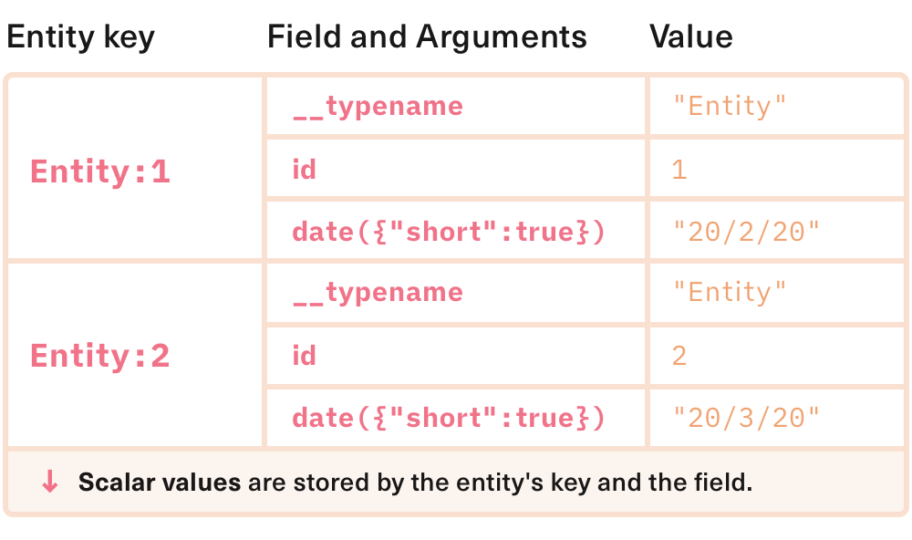

<h2 align="center">@urql/exchange-graphcache</h2>
<p align="center">
<strong>Extensions for normalized caching and other modern GraphQL patterns in <code>urql</code></strong>
<br /><br />
<a href="https://npmjs.com/package/@urql/exchange-graphcache">
  
</a>
<a href="https://travis-ci.org/FormidableLabs/urql-exchange-graphcache">
  
</a>
<a href="https://codecov.io/gh/formidablelabs/urql-exchange-graphcache">
  
</a>
<a href="https://bundlephobia.com/result?p=@urql/exchange-graphcache">
  
</a>
<a href="https://github.com/FormidableLabs/urql-exchange-graphcache#maintenance-status">
  
</a>
<a href="https://spectrum.chat/urql">
  
</a>
</p>

## ✨ Features

- 📦 A fast & small extension package
- 🌱 Normalized caching support
- 🗂 The `@populate` directive pattern
- 📱 Offline support _(Coming soon!)_

`@urql/exchange-graphcache` is an extension for the [`urql`](https://github.com/FormidableLabs/urql) GraphQL client
that adds normalized caching and other modern GraphQL patterns to it.

`urql` is already quite a comprehensive GraphQL client. But once you've built a basic app using it
you may need a couple of extensions to use solid and modern GraphQL patterns and to optimise your
app. **Optimistic updates** and **normalized resolvers** are parts to making your app more consistent
and reducing the number of requests it takes to update your app. **Auto-populating** mutations help
you to keep your mutations easy to understand while updating your normalized data.

## 📃 [Documentation](./docs/README.md)

This documentation provides more details on how to configure and use `@urql/exchange-graphcache`.
If you'd rather learn more about it first, read on instead.

During development, this package may output **warnings and errors**. Further explanation for each of
those can be found in [the "Help" section of our documentation](./docs/help.md).

- [Keys](./docs/keys.md)
- [Resolvers](./docs/resolvers.md)
- [Updates](./docs/updates.md)
- [Optimistic Updates](./docs/optimistic.md)
- [Schema](./docs/schema.md)
- [Help](./docs/help.md)

> ⚠️ Note: Documentation for some parts of `@urql/exchange-graphcache` are still being worked on!
> For help for features requests, please join our [Spectrum](https://spectrum.chat/urql).

## 🏎️ Intro & Showcase

### Installation

Assuming you've installed `urql` and `graphql` already, install `@urql/exchange-graphcache` alongside them:

```sh
yarn add @urql/exchange-graphcache
# or
npm install --save @urql/exchange-graphcache
```

You'll then need to add the `cacheExchange`, that this package exposes, to your `urql` Client,
by replacing the default cache exchange with it:

```js
import { createClient, dedupExchange, fetchExchange } from 'urql';
import { cacheExchange } from '@urql/exchange-graphcache';

const client = createClient({
  url: 'http://localhost:1234/graphql',
  exchanges: [
    dedupExchange,
    cacheExchange({
      /* config */
    }),
    fetchExchange,
  ],
});
```

### Normalized Caching

When the `cacheExchange` receives data from your GraphQL API, it normalises it and stores it
in a data structure that is similar to multiple database rows in a relational database’s table.
It does so by walking your GraphQL query, comparing it to the response from the API, and
storing values for each field by an entity’s key and by the field itself.
We call this structure "records."

The key for an entity is by default a combination of an object’s `__typename` field and its `id` or `_id`
field. (This can also be customised.)

The fields that are stored also include that fields arguments, if it has any.



In this example we’re storing `{ __typename: 'Entity', id: 1 }` as `"Entity:1"`
and `{ __typename: 'Entity', id: 2 }` as `"Entity:2"`.

We also need to store how these individual entities are related to one another.
This is stored as relatiomns in our data structure, which are like database relations.
We call this structure "links."

Links are stored identically to records of an entity, in a similar but separate structure.
The entries in this data structure are instead other entities’ keys, which can also be
`null` or arrays of keys.


In this diagram we see that our entities have been retrieved from an `entity` field on `Query`.
The root `Query` is treated as a normal, global entity. If we look at entries in this example
we know that `Query.entity(id: 1)` now contains `"Entity:1"`. We can also see that the
entities in our example refer to each other via a `sibling` field.
We're able to effectively look up relations.

Using this method, any given GraphQL data and query can be stored entirely in memory.
When a query is run, the normalised cache runs through its data structure and compares
each field against the in-memory database. When a field is found in the cache, it retrieves
data from there instead. And when data is written when a GraphQL response comes in,
it writes data to the in-memory database instead of reading from it.

> Explain keys!
> Explain how to customize keys!

### Local Resolvers

> What can I resolve from the cache?
> Explain how to resolve data locally!
> Explain pagination!
> Introduce `Cache` interface!
> Introduce `simplePagination` and `relayPagination`!

### Local Cache Updates

> What are updates?
> When can I do an update?
> Explain how to use updates to change the cache after mutations and subscriptions!

### Optimistic Updates

> What are optimistic updates?
> When do I use them? (small interactions rather than large ones)
> Explain how to set them up!
> Explain when they're reverted (after mutations complete, error or not)

### Schema Awareness

> How do I add a schema?
> How does Graphcache change when I add a schema?
> Explain the schema awareness!
> Explain "@populate" and the populateExchange!

## Maintenance Status

**Active:** Formidable is actively working on this project, and we expect to continue for work for the foreseeable future. Bug reports, feature requests and pull requests are welcome.
